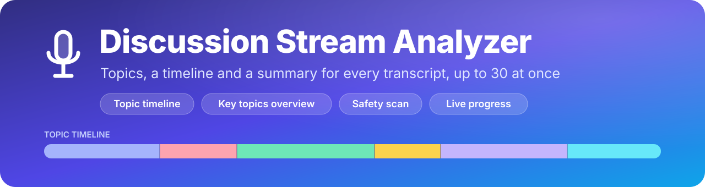

<div align="center">



### *Turn long conversations into a clear map of what was discussed*

[](https://www.python.org/)
[](https://streamlit.io/)
[](https://pytorch.org/)
[](https://huggingface.co/)
[](https://scikit-learn.org/)
[](LICENSE)
[](https://github.com/zarshanali/Discussion-stream-Analyzer/actions)

**Topic Modeling | Transcript Summarization | Sentence Embeddings | Batch Processing**

[Overview](#-overview) • [Features](#-key-features) • [Settings](#-settings-reference) • [How it works](#-how-it-works) • [Quick start](#-quick-start) • [Structure](#-project-structure) • [Troubleshooting](#-troubleshooting)

[](https://colab.research.google.com/github/zarshanali/Discussion-stream-Analyzer/blob/main/notebooks/colab_launcher.ipynb)

</div>

---

## 🌟 Overview

**Discussion Stream Analyzer** is a topic modeling and transcript summarization tool. It reads spoken or written dialogue (podcast episodes, meeting notes, interviews, customer call transcripts), finds the points where the subject changes, groups the pieces into topics, and writes a readable summary of each one.

It handles up to **30 transcripts in a single run** (`.txt`, `.md` and `.log` files, up to **200 MB each**), and every document gets its **own** overview, topic timeline and downloads. The interface is a Streamlit app that you can run locally, or from Google Colab through a Cloudflare Tunnel link.

> **Companion project:** the `.txt` files written by the multi-speaker speech-to-text app (`[00:00:01.00 - 00:00:03.00] speaker_0: ...`) load directly, so audio → transcript → topics is one pipeline.

### 🎯 Why this project?

Reading a two-hour transcript to find out what was discussed, and when, is slow. This tool turns it into a short overview, a colour-coded timeline and a list of key topics, and it is built to stay fast and reliable when you feed it a whole folder of files.

| | |
|---|---|
| ⚡ **Fast by design** | Every turn is embedded **once**; the windows used to detect topic changes are built from cumulative sums of those embeddings (no re-encoding). All titles and overviews for **all documents** are written by the language model in **one batched pass**, longest prompts first. |
| 🧩 **Per-document results** | Each transcript is analysed separately, so topics from one recording never leak into another. An "All documents" view compares them side by side. |
| 🛡️ **Fault tolerant** | One unreadable or empty file is marked failed; the others carry on. Duplicate file names are kept (`name`, `name (2)`), never overwritten. |
| 🔄 **Reload-safe** | The analysis runs in a background thread that is shared by every browser tab. Reloading the page does not lose the run. |
| 💻 **Works without a GPU** | Choose *No AI model* and the tool finishes quickly on a CPU, using the most central sentences as summaries. If the embedding model cannot load, it falls back to an offline TF-IDF method. |
| 🔐 **Private** | Models run on your own machine (or your own Colab runtime). Transcripts are never sent to an external API. |
| ✅ **Tested** | A pytest suite (parsing, segmentation, full pipeline, page rendering) runs offline in CI on every push. |

---

## 🚀 Key Features

<table>
<tr>
<td width="50%">

### 🧠 Topic Intelligence
- **Topic detection** with a sentence-embedding model (`MiniLM-L6` or `BGE-small`)
- **Change-point detection** that cuts a transcript where the subject really shifts
- **Automatic number of topics** (chosen per document, never above your limit)
- **Key terms** for every topic and segment (c-TF-IDF)
- **Summary writer**: an instruction-tuned LLM (`Qwen2.5`) writes each topic title, its description and the document overview

</td>
<td width="50%">

### 🎨 Interface
- **Live progress** with a per-document status tile, a progress-bar table and a timing breakdown
- **Results tab** with overview, topic timeline, topics table, safety scan and raw segments
- **Sidebar settings** for models, topic count, segment size and sensitivity
- **One-click downloads**: Markdown, CSV, JSON, or a ZIP of all reports
- **Saved runs** that can be reopened later

</td>
</tr>
<tr>
<td width="50%">

### 📥 Flexible Input
- Up to **30 files** per run, **200 MB** each
- `.txt`, `.md`, `.log` (UTF-8, UTF-16 or Latin-1 detected automatically)
- Timestamps and speaker names are **optional**
- Long paragraphs are split at sentence boundaries so even unformatted text has topic boundaries to find

</td>
<td width="50%">

### 🔧 Engineering
- Background job thread with live, thread-safe state
- Out-of-memory protection: a failed GPU batch is split in half and retried
- Offline fallback embedder and an extractive (no-LLM) summary mode
- Modular package, linted, with CI

</td>
</tr>
</table>

---

## 📊 What You Get

For **every** transcript:

| Output | What it shows |
|---|---|
| **Overview** | One paragraph saying what kind of recording it is, who is speaking (if mentioned) and the main subject, followed by **Key Topics Discussed**: a bold title and a short description for each topic. |
| **Topic Timeline** | A colour-coded bar and a card per block showing, in order, **which topic was discussed when**, with a short summary and key terms. Block widths are proportional to word count, so a long topic looks long. |
| **Topics table** | Share of the discussion per topic, number of segments, key terms and the time ranges where it appears. |
| **Safety Scan** | Every segment is checked for sensitive keywords and marked `PASS` or `FLAGGED`. See [the note below](#-safety-scan-what-it-does-and-does-not-do). |
| **Segments & raw text** | The exact text of every segment, so each summary can be checked against the source. |
| **Downloads** | `Report (.md)`, `Segments (.csv)` and `Full result (.json)` per document, plus a ZIP of all reports. |

Across the whole run:

| Output | What it shows |
|---|---|
| **Live Progress** | A progress bar, four KPI cards (documents finished, elapsed time, words analysed, words per second), a status tile per document, a live table, and a *Where the time went* breakdown (read / embed / topics / summaries). |
| **All documents view** | One row per transcript: words, number of topics, main topics and the first line of the overview. |
| **Saved runs** | Every run is written to `outputs/<timestamp>/` (one `.md` per document and a `results.json`). **Load last saved run** reopens it. |

---

## 🧠 How It Works

```mermaid
flowchart LR
    A["📄 Upload<br/>up to 30 transcripts"] --> B["📖 Parse<br/>turns, speakers, timestamps"]
    B --> C["🧬 Embed once<br/>MiniLM or BGE"]
    C --> D["✂️ Segment<br/>cut where the subject changes"]
    D --> E["🧭 Cluster<br/>group segments into topics"]
    E --> F["🏷️ Label<br/>c-TF-IDF key terms"]
    F --> G["🧠 Summarise<br/>one batched LLM pass"]
    G --> H["📊 Reports<br/>timeline, overview, downloads"]

    style A fill:#e0e7ff,stroke:#4f46e5
    style C fill:#fef3c7,stroke:#d97706
    style G fill:#f3e8ff,stroke:#7c3aed
    style H fill:#d1fae5,stroke:#059669
```



1. **Parse.** Each file is split into turns. Formats such as `[00:01:23] Alice: text`, `Alice: text`, `00:01:23 text` and plain lines are recognised. A label counts as a speaker only if it repeats, looks like a name, or looks like `speaker_0` / `Host` / `Guest`, so a sentence like "The point is: …" is not mistaken for one.
2. **Embed once.** All turns of all documents are encoded in a single batch (half precision on a GPU).
3. **Segment.** For every gap between turns, the text before and after is compared using the existing embeddings. Deep similarity valleys become boundaries (a TextTiling-style approach), and over-long segments are split at their weakest point.
4. **Cluster.** Segments are grouped with average-linkage clustering on cosine distance. The number of topics is picked by silhouette score, and topics smaller than 6% of the words are merged into their nearest neighbour.
5. **Label.** c-TF-IDF (the idea behind BERTopic) finds the words that are frequent in one topic but rare in the others.
6. **Summarise.** The language model receives the most central sentences of each topic and writes a title and description; one more prompt per document writes the overview paragraph. All prompts of all documents are sorted by length, grouped into batches, and run together.

### 🧱 Core Technical Stack

| Role | Default | What it does |
|:---|:---|:---|
| **Topic Detection Model** | `Fast · MiniLM-L6` (`all-MiniLM-L6-v2`) | A lightweight, efficient sentence-transformer that converts each turn into a dense vector, so semantic similarity can be measured and topic shifts detected. |
| **Summary Writer Model** | `Fast · Qwen2.5-1.5B` (`Qwen2.5-1.5B-Instruct`) | An instruction-tuned LLM for quick narrative summaries of the detected topics. It is prompted to use only facts stated in the text and to keep names, places and numbers. |
| Optional upgrades | `Better · BGE-small`, `Better · Qwen2.5-3B` | Higher quality, slower. |
| Fallbacks | TF-IDF + LSA, key-sentence summaries | Used when the embedding model cannot load, or when *No AI model* is selected. |
| Interface | Streamlit | Fragment-based live dashboard, background job thread. |

---

## 🔧 Settings Reference

All settings live in the sidebar.

### 1. AI summary for every timeline block &nbsp;`Toggle`

Controls how each block of the topic timeline is summarised.

| State | Behaviour |
|:---|:---|
| **Off** *(default)* | Each timeline block shows its most central sentences. Topic names and overviews are still written by the language model. Saves processing time and keeps the run fast. |
| **On** | The language model writes a 1–2 sentence summary for every block. Better prose, slower. |

Disabled automatically when the summary writer is set to *No AI model*.

### 2. Most topics per document &nbsp;`Slider: 2 to 12` · default `6`

Sets the **upper limit** on how many topic clusters a transcript can have. It is a ceiling, not a target: the tool tries every count from 2 up to the limit and keeps the one that separates the topics best, so a short, focused transcript can still end up with fewer.

Within that limit, the tool consolidates topics by:

1. **Size:** topics that cover under 6% of the words are merged into their closest neighbour, so brief side conversations don't become topics of their own.
2. **Semantic similarity:** segments whose embeddings are close are grouped into one broader theme.
3. **Cluster quality:** the silhouette score prefers a smaller number of clearly separated topics over many overlapping ones.

### 3. Smallest segment (turns) &nbsp;`Slider: 3 to 20` · default `5`

- **What a "turn" is:** a single line of speech, usually one speaker's contribution (Speaker A speaks, then Speaker B responds = 2 turns). Very long paragraphs are split into pieces of about 70 words, and each piece counts as a turn.
- **What it does:** sets the **minimum length** a segment needs before the tool may declare a topic boundary.
- **Purpose:** keeps small talk, quick jokes and brief clarifications from fragmenting the analysis into tiny, noisy blocks.
- **Why capped at 20:** a higher minimum would force clearly different topics into one large block.

| Setting | Best for |
|:---|:---|
| **Low (3–6)** | Fast-paced Q&A, debates, interviews where topics change quickly |
| **Medium (8–14)** | Standard podcasts and multi-speaker meetings |
| **High (15–20)** | Long lectures, monologues, deep-dive presentations |

### 4. Topic-change sensitivity &nbsp;`Slider: 1 to 9` · default `6`

Controls how readily the change-point detector reacts to subtle shifts in subject matter.

| Range | Behaviour |
|:---|:---|
| **Low (1–3)** | Strict: only splits when the subject changes drastically. |
| **Balanced (4–6)** | Splits at clear shifts. The default sits here. |
| **High (7–9)** | Aggressive: treats minor contextual shifts as new boundaries. Useful for fast-moving, multi-subject conversations. |

### 5. Models

| Setting | Options |
|:---|:---|
| **Topic detection model** | `Fast · MiniLM-L6` (about twice as quick) or `Better · BGE-small` |
| **Summary writer** | `Fast · Qwen2.5-1.5B`, `Better · Qwen2.5-3B`, or `No AI model · instant` (runs on a CPU) |

Also in the sidebar: **Load last saved run**, and a readout of the detected GPU.

> 💡 **Tip:** if topics look too coarse, raise the sensitivity or lower the smallest segment. If they look fragmented, do the opposite, or lower *Most topics per document*.

---

## ⚡ Quick Start

### Option A · Run locally

```bash
# 1. Clone the repository
git clone https://github.com/zarshanali/Discussion-stream-Analyzer.git
cd Discussion-stream-Analyzer

# 2. Create an environment
python -m venv .venv
source .venv/bin/activate            # Windows: .venv\Scripts\activate

# 3. Install PyTorch for your machine first: https://pytorch.org/get-started/locally/
#    then the rest of the dependencies
pip install -r requirements.txt

# 4. Start the app
streamlit run app.py
```

The first run downloads the models (roughly 100 MB for the embedder and several GB for Qwen); later runs use the cache.
The AI summary writer needs a **CUDA GPU**. Without one, select **No AI model** in the sidebar.

### Option B · Run in Google Colab (free GPU)

1. Open `notebooks/colab_launcher.ipynb` in Colab (or use the **Open in Colab** badge above).
2. **Runtime → Change runtime type → T4 GPU.**
3. Set `REPO_URL` in the first cell to your repository, then **Run all**.
4. Open the printed `trycloudflare.com` link and keep the last cell running.

> ⚠️ The Colab link is public and has security checks turned off so the tunnel can work. Don't share it.

### Using the app

1. **Upload** up to 30 transcripts in the left panel and press **🚀 Analyze**.
2. Watch the **📊 Live progress** tab. You can switch tabs or reload the page; the run continues.
3. Open the **📄 Results** tab, choose a document (or *All documents*), and download what you need.

---

## 📥 Supported Input

Speakers and timestamps are optional. All of these work, and they can be mixed:

```text
[00:01:23] Alice: Welcome back to the show.
Alice: Welcome back to the show.
00:01:23 Welcome back to the show.
Welcome back to the show.
[00:00:01.00 - 00:00:03.00] speaker_0: Output of the speech-to-text app.
```

Without timestamps, ranges in the timeline are shown as turn numbers (`turn 12 → turn 30`).

---

## 🔒 Safety Scan: What It Does and Does Not Do

The safety scan is a **keyword check**. It looks for sensitive terms (`confidential`, `secret key`, `password`, `api_key` / `api key`, `leak`, `private key`) in each segment and marks the segment `PASS` or `FLAGGED` with the matching words, so you know where to look.

It is a quick screening aid. It does **not** understand context and is **not** a substitute for a compliance or moderation review.

---

## 📁 Project Structure

```
Discussion-stream-Analyzer/
├── 📜 app.py                      # Streamlit entry point
├── 📂 stream_analyzer/
│   ├── config.py                  # limits, model choices, colours
│   ├── parsing.py                 # raw text → turns (timestamps, speakers)
│   ├── text.py                    # stop words, key sentences, c-TF-IDF keywords
│   ├── embeddings.py              # sentence embeddings + offline TF-IDF fallback
│   ├── segmentation.py            # topic boundaries and clustering
│   ├── pipeline.py                # analyse one document (no LLM needed)
│   ├── llm.py                     # Qwen prompts and batched generation
│   ├── job.py                     # background job: all documents, live progress
│   ├── exporters.py               # Markdown reports, saved runs
│   └── ui.py                      # the Streamlit page
├── 📂 tests/                      # pytest suite: parsing, pipeline, page rendering
├── 📂 notebooks/
│   └── colab_launcher.ipynb       # one-click launcher for Google Colab
├── 📂 docs/
│   └── banner.svg                 # README banner
├── 📂 .streamlit/
│   └── config.toml                # theme and server settings
├── 📂 .github/workflows/
│   └── tests.yml                  # lint + tests on every push
├── 📜 requirements.txt
├── 📜 requirements-dev.txt
├── 📜 LICENSE
└── 📜 README.md
```

---

## 🧪 Testing

```bash
pip install -r requirements-dev.txt
python -m pytest -q
```

The tests use the offline TF-IDF embedder, so they need **no GPU and no model download**. They cover transcript parsing, topic-boundary detection, clustering edge cases, a full end-to-end run (including a deliberately empty file that must fail without stopping the others), and rendering of the idle page and the results views. GitHub Actions runs the same checks, plus a lint pass, on every push.

---

## 🔍 Troubleshooting

<details>
<summary><b>"No GPU found" when loading the summary writer</b></summary>

The language model needs a CUDA GPU. Select **No AI model · instant** in the sidebar, or switch to a GPU runtime (in Colab: *Runtime → Change runtime type → T4 GPU*).
</details>

<details>
<summary><b>Topics look too coarse or too fine</b></summary>

Raise *Topic-change sensitivity* or lower *Smallest segment* for more topics; do the opposite for fewer. You can also try the `Better · BGE-small` model, or change *Most topics per document*.
</details>

<details>
<summary><b>A file is marked "Failed"</b></summary>

The *Note* column in the live table gives the reason. The most common one is a file with no readable text. Other files in the run are not affected.
</details>

<details>
<summary><b>The page doesn't load in Colab</b></summary>

Run `!tail -n 40 /content/streamlit_logs.txt` in a new cell to see the app log, then re-run the last cell of the launcher.
</details>

<details>
<summary><b>Code changes don't show up</b></summary>

The Streamlit file watcher is turned off in `.streamlit/config.toml` to avoid PyTorch watcher errors. Restart the app after editing code.
</details>

<details>
<summary><b>The first run is slow</b></summary>

The models are downloaded the first time they are used. Later runs load them from the local cache.
</details>

---

## 🚧 Limitations

- Tuned for **English** transcripts (stop-word lists and the default embedding model are English).
- AI summaries are generated by a small language model. They are prompted to stay faithful to the text, but they can still contain mistakes, so use the *Segments & raw text* view to verify anything important.
- AI summaries need a **CUDA GPU**; the no-GPU mode produces extractive (key-sentence) summaries instead.
- Topics are found within each document; they are not matched across documents.

## 🧭 Roadmap Ideas

- [ ] 🔗 Group matching topics **across** documents
- [ ] 🗣️ Per-speaker talk-time and topic statistics
- [ ] 🌍 Multilingual embedding model option
- [ ] 📄 PDF / HTML report export

---

## 🤝 Contributing

Contributions are welcome.

1. Fork the repository
2. Create a branch (`git checkout -b feature/my-feature`)
3. Install the dev dependencies and run `python -m pytest -q`
4. Commit and push (`git commit -m "Add my feature"`, `git push origin feature/my-feature`)
5. Open a pull request

## 📄 License

This project is licensed under the **MIT License**. See the [LICENSE](LICENSE) file for details.

> The code is MIT-licensed. The AI models are **not** part of this repository: they are downloaded from Hugging Face on first use and each has its own license (see its model card).

---

## 👨‍💻 Author

<div align="center">

**Muhammad Zarshan Ali**

[](https://github.com/zarshanali)

</div>

## 🙏 Acknowledgments

- [Sentence-Transformers](https://www.sbert.net/) for the `MiniLM` and `BGE` embedding models
- [Qwen](https://huggingface.co/Qwen) and [Hugging Face Transformers](https://huggingface.co/docs/transformers) for the summary writer
- [scikit-learn](https://scikit-learn.org/) for clustering, TF-IDF and silhouette scoring
- [Streamlit](https://streamlit.io/) for the interface
- Hearst's **TextTiling** and Grootendorst's **BERTopic** (c-TF-IDF), which inspired the segmentation and topic-labelling steps
- [Cloudflare Tunnel](https://developers.cloudflare.com/cloudflare-one/connections/connect-networks/) for the free public link in Colab

<div align="center">

---

### ⭐ If this project helps you, consider giving it a star

[Back to top ⬆️](#)

</div>
